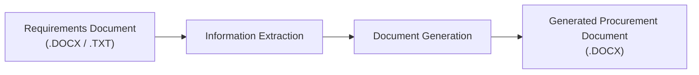

# SOLGulf Procurement Document Generator

An automated procurement document generation system developed for **SOLGulf** to streamline the creation of procurement documents by extracting information from requirements documents and populating approved Microsoft Word templates.

---

## Project Overview

This application processes a requirements document (`.DOCX` or `.TXT`), extracts the required procurement information, and automatically generates a completed Microsoft Word (`.DOCX`) document using an approved document template.

The first iteration focuses on generating a **Master Services Agreement (MSA)**. However, the architecture has been designed so that additional procurement document templates can be supported in future iterations.

### Workflow



---

## Features

- Upload procurement requirements documents (`.DOCX` or `.TXT`)
- Extract key procurement information from structured or unstructured text
- Map extracted information to document placeholders
- Automatically generate Microsoft Word procurement documents
- Download completed documents in `.DOCX` format
- Human review step before document generation (planned)

---

## Technology Stack

| Component | Technology |
|-----------|------------|
| Programming Language | Python |
| User Interface | Streamlit |
| Document Processing | python-docx |
| Version Control | Git & GitHub |

---

## Project Structure

```text
SOLGulf-Procurement-Generator/
│
├── app.py
├── requirements.txt
├── templates/
│   └── master_services_agreement.docx
│
├── assets/
│   └── solgulf_logo.png
│
└── README.md
```

---

## Current Status

This project is currently under active development.

The current focus is implementing the core procurement document generation workflow:

- Requirements document upload
- Information extraction
- Document generation
- Microsoft Word document download

Future iterations will introduce support for additional procurement document templates and further enhancements to the information extraction process.

---

## Planned Improvements

- Support multiple procurement document templates
- Improve information extraction accuracy
- Additional document validation
- Enhanced user interface
- Expanded document generation capabilities

---

## Author

**Yahhiya Khawaja**

Developed as part of an enterprise case study project in collaboration with **SOLGulf**.
