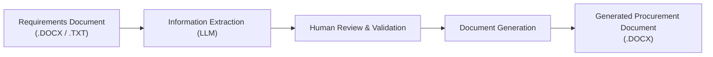

```markdown
# SOLGulf Procurement Document Generator

An automated procurement document generation system developed for **SOLGulf** to streamline the creation of procurement documents by extracting information from requirements documents and populating approved Microsoft Word templates.

---

## Project Overview

This application processes a procurement requirements document (`.DOCX` or `.TXT`), extracts the required information, and generates a completed Microsoft Word (`.DOCX`) document using an approved document template.

The first iteration focuses on generating a **Master Services Agreement (MSA)**. The architecture is being designed to support additional procurement document templates in future iterations.

### Workflow



---

## Features

* Upload procurement requirements documents (`.DOCX` or `.TXT`)
* Extract key procurement information from structured or unstructured text using an LLM
* Human review step to confirm or correct extracted information before generation
* Map validated information to document placeholders
* Automatically generate Microsoft Word procurement documents
* Download completed documents in `.DOCX` format
* Support for centrally stored and approved document templates

---

## Technology Stack

| Component | Technology |
| --- | --- |
| **Frontend** | React + Vite |
| **Backend / Document Processing** | Python |
| **Document Reading** | `python-docx` |
| **Document Generation** | `docxtpl` |
| **Information Extraction (LLM)** | Google Gemini API |
| **Data Validation** | Pydantic |
| **Version Control** | Git & GitHub |

The frontend and backend are being developed as separate components, with the React application providing the user interface and the Python backend handling document processing, information extraction, and document generation.

---

## Project Structure

```text
SOLGulf-Procurement-Generator/
│
├── frontend/
│   ├── src/
│   ├── public/
│   ├── package.json
│   └── vite.config.js
│
├── app.py
├── requirements.txt
├── .env                  # not committed — holds API key
├── .gitignore
│
├── templates/
│   └── master_services_agreement.docx
│
├── docs/
│   └── SOLGulf_Procurement_Document_Generation_System.pdf
│
├── generated/
│   └── (output documents)
│
├── assets/
│   └── solgulf_logo.png
│
└── README.md

```

> The current Streamlit implementation is retained as an earlier prototype while the production-oriented React frontend is developed.

---

## Current Status

This project is currently under active development.

### Completed so far:

* Development environment set up
* Initial system architecture designed and reviewed with stakeholder
* Initial procurement document generation workflow defined
* UI workflow and mockups developed
* React + Vite frontend environment established

### In progress:

* React frontend implementation
* Requirements document upload interface
* LLM-based information extraction
* Human review interface
* Document generation workflow
* Integration between the frontend and Python processing layer

Future iterations will introduce support for additional procurement document templates and further enhancements to the information extraction process.

---

## Planned Improvements

* Support multiple procurement document templates
* Centrally manage approved document templates
* Improve information extraction accuracy
* Additional document validation
* Integration between React frontend and Python backend
* Expanded document generation capabilities
* Authentication and user permissions

---

## Author

**Yahhiya Khawaja**

Developed as part of an enterprise case study project in collaboration with SOLGulf.

```

```
