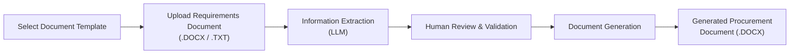

# Procurement Document Generator

An automated procurement document generation system that extracts information from requirements documents and populates approved Microsoft Word templates.

**Live Demo:** https://procurement-doc-generator.vercel.app/

---

## Project Overview

The system processes procurement requirements documents (`.DOCX` or `.TXT`), uses an LLM to extract the required information, and generates a completed Microsoft Word (`.DOCX`) document using a selected template.

It supports multiple document templates while maintaining consistent formatting and structure.

### Workflow



---

## Features

* Select from multiple procurement document templates
* Upload procurement requirements documents (`.DOCX` or `.TXT`)
* Extract key procurement information using an LLM
* Review and validate extracted information before generation
* Map validated information to document placeholders
* Automatically generate Microsoft Word procurement documents
* Download completed documents in `.DOCX` format
* Admin and normal user accounts
* Admin user management
* Admin template management
* Automatically generate template placeholders using Gemini
* Manually review and edit generated placeholders
* Store approved templates for use in the document workflow

---

## Technology Stack

| Component                     | Technology        |
| ----------------------------- | ----------------- |
| Frontend                      | React + Vite      |
| Backend / Document Processing | Python            |
| Document Reading              | `python-docx`     |
| Document Generation           | `docxtpl`         |
| Information Extraction (LLM)  | Google Gemini API |
| Data Validation               | Pydantic          |
| Version Control               | Git & GitHub      |

The React frontend provides the user interface, while the Python backend handles document processing, authentication, information extraction, validation, template management, and document generation.

---

## Project Structure

```text
Procurement-Document-Generator/
│
├── frontend/
│   ├── src/
│   ├── public/
│   ├── package.json
│   └── vite.config.js
│
├── backend/
│   ├── ...
│   └── ...
│
├── sample_templates/
│   └── ...
│
├── .gitignore
└── README.md
```

Sensitive configuration such as API keys is stored using environment variables and is not committed to the repository.

