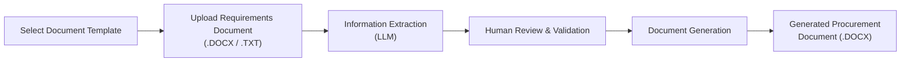

# Procurement Document Generator

An automated procurement document generation system designed to streamline the creation of procurement documents by extracting information from requirements documents and populating approved Microsoft Word templates.

---

## Project Overview

This application processes a procurement requirements document (`.DOCX` or `.TXT`), extracts the required procurement information, and generates a completed Microsoft Word (`.DOCX`) document using an approved document template.

The system supports multiple procurement document templates, allowing the same workflow to be used for different document types while maintaining consistent formatting and structure.

### Workflow



---

## Features

* Select from multiple procurement document templates
* Upload procurement requirements documents (`.DOCX` or `.TXT`)
* Extract key procurement information from structured or unstructured text using an LLM
* Human review step to confirm or correct extracted information before generation
* Map validated information to document placeholders
* Automatically generate Microsoft Word procurement documents
* Download completed documents in `.DOCX` format
* Support for centrally stored and approved document templates
* Admin and normal user accounts
* Admins can add and manage users
* Admins can add new document templates
* Automatically generate template placeholders using Gemini
* Manually review and edit generated placeholders before approving a template
* Approved templates are stored and made available to users

---

## Technology Stack

| Component                     | Technology        |
| ----------------------------- | ----------------- |
| Frontend                      | React + Vite      |
| Backend / Document Processing | Python            |
| Document Reading              | `python-docx`     |
| Document Generation           | `docxtpl`         |
| Information Extraction (LLM)  | Google Gemini API |
| Data Validation               | Pydantic          |
| Version Control               | Git & GitHub      |

The frontend and backend are developed as separate components, with the React application providing the user interface and the Python backend handling document processing, information extraction, validation, template management, and document generation.

---

## Project Structure

```text
Procurement-Document-Generator/
│
├── frontend/
│   ├── src/
│   ├── public/
│   ├── package.json
│   └── vite.config.js
│
├── backend/
│   ├── ...
│   └── ...
│
├── sample_templates/
│   └── ...
│
├── .gitignore
│
└── README.md
```

Sensitive configuration such as API keys is stored using environment variables and is not committed to the repository.

---

## Current Status

This project is currently under active development.

### Completed

* Development environment set up
* Initial system architecture designed
* Initial procurement document generation workflow defined
* UI workflow and mockups developed
* React + Vite frontend environment established
* Multiple procurement document templates supported
* Admin and normal user accounts implemented
* Admin user management implemented
* Admin template management implemented
* Automatic template placeholder generation using Gemini implemented
* Manual placeholder review and editing implemented
* Approved templates stored and made available to users
* Requirements document upload interface implemented
* LLM-based information extraction implemented
* Human review and validation interface implemented
* Document generation workflow implemented
* Integration between the React frontend and Python processing layer implemented

### In Progress

* Improving information extraction accuracy
* Improving error handling and user feedback
* Further improving the user interface and overall workflow

---

## Planned Improvements

* Add automated testing
* Improve system monitoring
* Expand document generation capabilities
* Further improve the user interface and overall workflow

---

## Author

**Yahhiya Khawaja**

A software project exploring the use of **LLMs, document processing, and workflow automation** to streamline procurement document generation.
